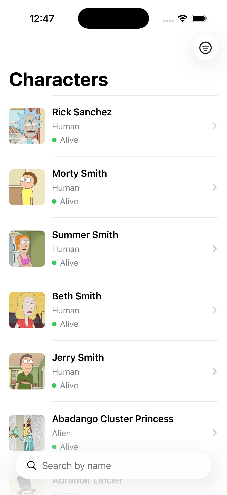
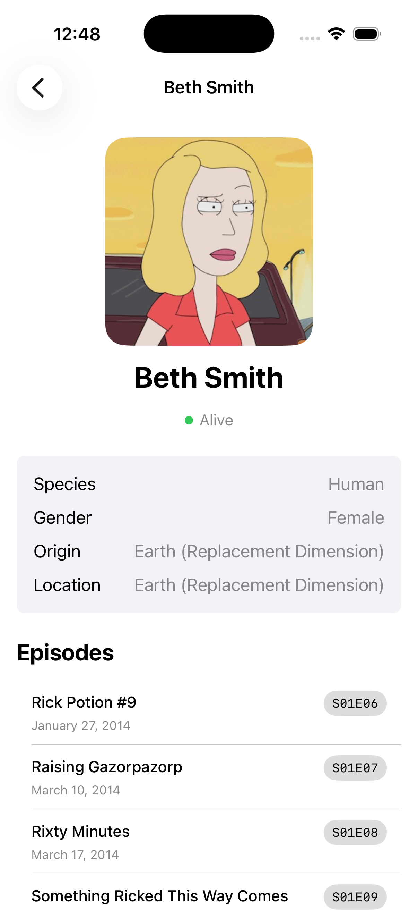
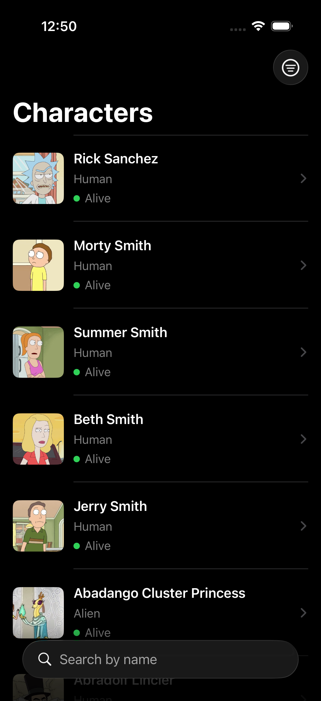
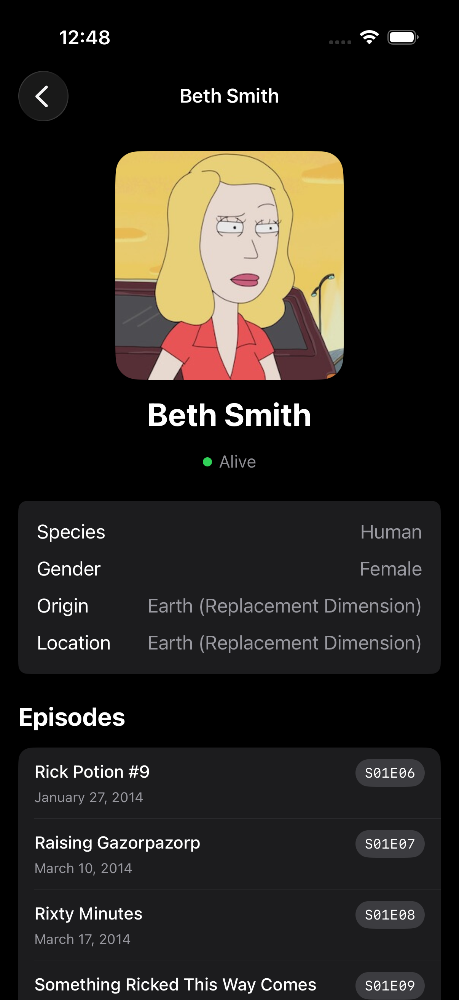

# Rick & Morty

A Rick & Morty character browser built for a Senior iOS Developer technical assessment. Two screens — a paginated, searchable/filterable characters list and a character detail screen with lazily-loaded episodes — backed by the public [Rick and Morty API](https://rickandmortyapi.com/).

## Screenshots

| Characters List | Character Details |
| --- | --- |
|  |  |
|  |  |

## Requirements

- Xcode 16.0+
- Swift 6.0
- iOS 18.0+ (simulator or device)

No API key or backend setup required — the app talks directly to `https://rickandmortyapi.com/api`.

## Setup

1. Clone the repository and open `Rick&Morty_app.xcodeproj` in Xcode.
2. Xcode resolves the one Swift Package dependency ([Nuke](https://github.com/kean/Nuke) 13.2.0, for image loading/caching) automatically on first build.
3. Select the `Rick&Morty_app` scheme and run on an iOS 18+ simulator or device.
4. Run tests with `Cmd+U`, or via the Test navigator on the `Rick&Morty_appTests` target.

## Architecture

MVVM + Repository, in layers with dependencies pointing inward:

```
App        composition root (AppContainer) + entry point
Features   SwiftUI views + @Observable ViewModels (CharactersList, CharacterDetails)
Domain     plain Swift models the UI and repositories agree on (Character, Episode, Page<T>, ...)
Data       repositories, remote data sources, DTOs, mappers, SwiftData cache
Core       networking primitives (HTTPClient, Endpoint, NetworkError, NetworkLogger)
UI         shared, feature-agnostic views (RemoteImageView, StatusBadgeView, empty/error states)
```

`Domain` has no dependency on `Data` or `Features` — it's the shared vocabulary both sides map to/from. `Features` depends on `Domain` and on repository *protocols*, never on `Data`'s concrete types directly.

### Dependency injection

Constructor injection throughout, no DI framework. `AppContainer` ([AppContainer.swift](Rick&Morty_app/App/AppContainer.swift)) is the single composition root: it builds the `ModelContainer`, `LocalStore`, `URLSessionHTTPClient`, and both repositories once at launch, and hands them down through initializers. `RickAndMortyApp` creates one `AppContainer` and passes its repositories into `CharactersListScreen`; every ViewModel below that receives a repository *protocol*, not a concrete type, so tests substitute mocks with no framework involved.

### Networking layer

- `Endpoint` — a protocol each API call conforms to (`CharacterEndpoint`, `EpisodeEndpoint`), producing a `URLRequest` from a path, method, headers, and query items.
- `HTTPClient` — a protocol around "send this endpoint, decode that type," with `URLSessionHTTPClient` as the real implementation. Requests are logged, executed, mapped from HTTP status codes to typed errors, and decoded.
- `NetworkError` — a typed error enum (`noInternetConnection`, `timeout`, `notFound`, `serverError`, `decoding`, ...) with a `NetworkErrorMapper` that classifies `URLError`s and HTTP status codes. Repositories branch on specific cases (e.g. treating a 404 on the character search as an empty result, not a failure).
- `NetworkLogger` — an `OSLog`-backed logger that prints every request/response/error (method, URL, headers, pretty-printed JSON body) in `DEBUG` builds only, visible in Xcode's console or Console.app under the "Network" category.

### Persistence & offline behavior

`LocalStore` is a `@ModelActor` wrapping a SwiftData `ModelContainer` (`CachedCharacter`, `CachedEpisode`). Repository policy:

- **Remote-first, write-through cache.** A successful network fetch is mapped to domain models, returned immediately, and cached in the background (a cache write failure never fails a successful network response).
- **Cache fallback on failure.** If the network call fails (offline, timeout, server error), the repository serves whatever matches the current filter from the cache instead. Real pagination can't be verified without the network, so a cache-served page always reports `hasNextPage = false` — a documented assumption, not a bug.
- **404 as empty, not error.** The API returns 404 when a character search/filter matches nothing; the repository treats that as an empty page rather than surfacing an error screen.
- Episodes are fetched once and cached indefinitely (they're immutable on the API side); `EpisodeRepository` only requests the IDs missing from the cache, in a single batched request where possible.
- `CachedCharacter`/`CachedEpisode` use `@Attribute(.unique)` on `id`, so re-inserting an existing row upserts it — no manual fetch-then-update needed.

### Image loading

[Nuke](https://github.com/kean/Nuke)/NukeUI's `LazyImage`, wrapped in `RemoteImageView`, for async loading with automatic memory + disk caching and a placeholder/error fallback.

### State management

Each ViewModel is an explicit state machine rather than a grab-bag of booleans:

```swift
enum State: Equatable { case idle, loading, loaded, empty, error(String) }
```

`CharactersListViewModel` additionally tracks `isLoadingNextPage`/`isRefreshing` as separate overlay flags (a page-2 spinner or pull-to-refresh shouldn't blank the screen the way the initial load's `.loading` state does). `CharacterDetailsViewModel` has its own `EpisodesState` for the same reason — the character info renders immediately while episodes load independently and lazily (`.task` on first appearance, not on init, so navigating to a detail screen never fetches episodes it doesn't need).

## Features

**Characters List**
- Infinite scroll pagination (loads the next page 5 rows before the end, de-duplicates by ID)
- Debounced search by name (400ms), status filter, client-side A–Z/Z–A sort
- Pull-to-refresh, retry on failure, empty state, redacted loading skeleton
- Dark Mode and Dynamic Type, via system semantic colors throughout

**Character Details**
- Image, name, status, species, gender, origin, current location
- Episodes loaded lazily from the character's episode URLs, decoded to `S01E01`-style codes, with their own loading/error/retry state

## Testing

Swift Testing, no UI/snapshot tests. Everything below `Features` and `Data` is testable through protocols:

- **Networking** — `NetworkErrorMapper` status/URLError mapping, and `URLSessionHTTPClient` against a stubbed `URLProtocol` (success, 404, 5xx, empty body, malformed JSON).
- **Mapping** — DTO → domain fallbacks (unknown status/gender, empty type, malformed episode URLs).
- **Repositories** — remote success + cache write, 404-as-empty, cache fallback on failure, cache-miss rethrow — using an in-memory `ModelContainer` and actor-based mock data sources.
- **ViewModels** — pagination, de-duplication, search/filter/sort, error/empty states, and episode lazy-loading — using actor-based mock repositories.

## Assumptions

- `hasNextPage` is always `false` when a page is served from the cache (see [Persistence & offline behavior](#persistence--offline-behavior)).
- The API's `status`/`gender` string fields are mapped to enums with an `.unknown` fallback for any value the API might add later, rather than failing to decode.
- Sorting and status filtering are client-side conveniences on top of the API's own `name`/`status` query parameters — the API doesn't support sorting itself.
